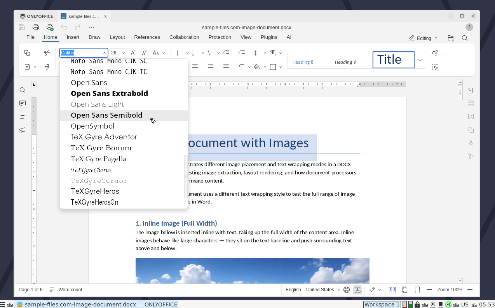

# What is this?

This repository is a Nix flake containing a NixOS virtual machine you can use to test ONLYOFFICE DesktopEditors with good font support, as implemted in Nixpkgs PR [526315](https://github.com/NixOS/nixpkgs/pull/526315).

The virtual machine is *super* minimalist, only providing onlyoffice, a terminal, and labwc as a Wayland compositor. A sample document is provided (in the `Documents` directory).



# Getting started

## How to build the virtual machine

There are two virtual machines available:

- `minimal` - This VM includes the fonts installed by default on NixOS.
- `full` - This VM is based on `minimal`, but adds Google Fonts and increases the VM's CPU and memory usage.

To build the `minimal` NixOS virtual machine, run:

```
nixos-rebuild build-vm --flake github:emmanuelrosa/onlyoffice4nixos#minimal
```

Replace *minimal* in the command above with *full* to build the `full` virtual machine instead. However, beware: The *full* VM includes nearly 4,000 fonts. ONLYOFFICE running in the VM struggles mightly with this due to the amount of I/O that hits the virtual disk.

Either way, you should end up with a symlink in your working directory.

## How to use the virtual machine

To run the Qemu/KVM virtual machine, run:

```
./result/bin/run-nixos-vm
```

The VM should automatically log you in as *johngalt*, but in case you need the password, it's *onlyoffice*.

Once logged in, you can get access to onlyoffice using the menu on the bottom left of the screen, or by rlight-clicking on the desktop.

To shut down, use the virtual machine's menu; The bar's shutdown menu doesn't work.

## How to clean up after the virtual machine

Aside from the symlink mentioned earlier, the virtual machine will create a nixos.qcow2 file. Once you're done with the virtual machine, you can delete both, the symlink (`result`) and the disk image (`nixos.qcow2`).

# What's included?

The following is a non-exhaustive list of what's included in the *minimal* virtual machine. It's not much since its only purpose is for testing onlyoffice font support on NixOS.

The *full* virtual machine is identical, but it adds the `google-fonts` package, which adds **many** more fonts to the virtual machine.

## Programs

- Terminal: alacritty
- onlyoffice (desktop editors) 
- labwc
- labwc-menu-generator
- swaybg
- sfwbar
- greetd
- tuigreet 

## Fonts

- NotoSansCJK-VF
- texgyreadventor
- texgyrebonum
- texgyrechorus
- texgyreheros
- texgyreheroscn
- texgyrepagella
- texgyreschola
- texgyretermes
- unifont
- DejaVuMathTeXGyre
- DejaVuSans
- DejaVuSerif
- FreeMono
- FreeSans
- FreeSerif
- LiberationMono
- LiberationSans
- LiberationSerif
- LiberationSerif
- LiberationSerif
- LiberationSerif
- NotoColorEmoji

# PS

If you want to test ONLYOFFICE on bare-metal instead of using the VM, you can try this:

```
nix run github:emmanuelrosa/onlyoffice4nixos#onlyoffice-demo-minimal
```

or this ...

```
nix run github:emmanuelrosa/onlyoffice4nixos#onlyoffice-demo-full
```
